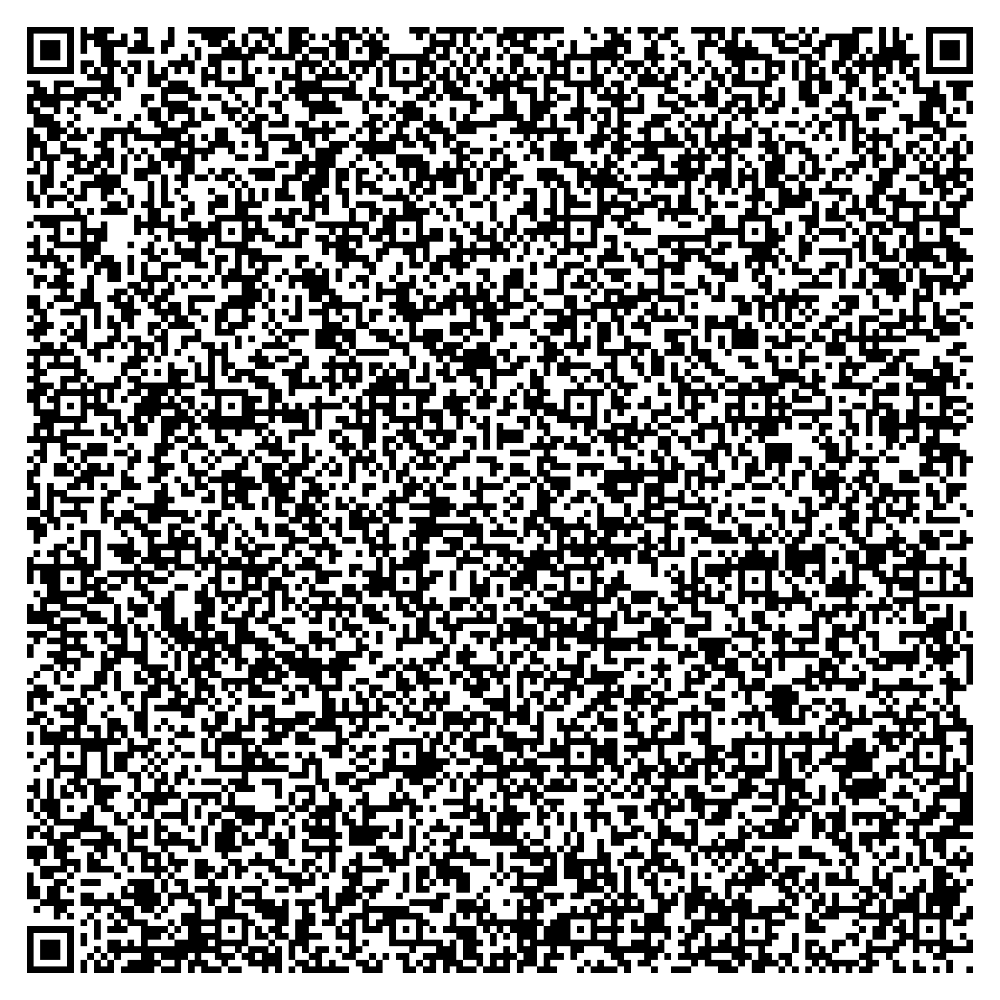

<h1 align="center">The Backdooms: Running DOOM on a QR Code</h1>


<p align="center">
    
</p>
<p align="center" style="font-size: small; font-weight: lighter;">
    Yes, this is literally the entire game.
</p>

<p align="center">


</p>

## 🚀 Project Overview

**The Backdooms** is a compressed, self-extracting and infinitely generating HTML game inspired by DOOM 1993 and The Backrooms that can be launched and played in a web browser directly from a QR code.

This project was a week-long study I performed designed to push the limits of QR code storage and compression, to demonstrate an innovative method of hosting lightweight web applications entirely within a QR code.

---

<p align="center">
    <a href="https://kuberwastaken.github.io/backdooms">Play a slightly less compressed version of this game here</a>
</p>

---

## 📜 Features

✅ **Fully Offline:** No internet connection is required to play the game after scanning the QR code. The URL basically has the ENTIRE code to the game

✅ **Extreme Compression:** Utilizes Gzip compression along with base64 encoding to make the final result extremely compressed.

✅ **Self-Extracting Webpage:** Uses the `DecompressionStream` API to dynamically decompress and execute the game within the browser.

---

## 📦 Installation & Dependencies

Well, technically speaking, just a modern web browser.

 But if we do get into the nitty gritty of generating a QR code of a ≈ 2.5kb game:

### Prerequisites
- **Python 3.7+**
- `qrcode` library (for generating QR codes)
- `pillow` (for QR code image handling)

### Install Dependencies
```bash
pip install qrcode[pil]
```

---

## 🛠️ Usage

### 1️⃣ Convert Your Game to a QR Code
Run the script with the following command:
```bash
python3 finalqr.py <your-game.html> <output-qrcode.png>
```
Example:
```bash
python3 finalqr.py EVEN-SMALLER-SLAMMER-BACKROOMS.html qrcode.png
```

### 2️⃣ Scan the QR Code
Use a smartphone or QR scanner to open the game directly in a web browser.

### 3️⃣ Play Instantly 🎮
Enjoy *The Backdooms* without needing to download or install anything!

---

## 🔍 Technical Breakdown

### Compression Workflow


**Read Input HTML:** The process starts by reading the given HTML content from a file or input source.

**Gzip Compression:** The HTML is compressed using Gzip with the highest compression level (compresslevel=9).

**Base64 Encoding:** The compressed data is encoded in Base64, ensuring that it remains text-based and can be embedded in an HTML file safely.

**Embedding in HTML Wrapper:** A JavaScript-based self-extracting HTML wrapper is created. This wrapper includes a DecompressionStream API function that automatically decompresses the content when opened in a browser.

**Data URI Conversion:** The entire HTML is converted into a data:text/html;base64,... format, allowing it to be stored and shared easily without a physical file.

### QR Code Generation Logic

The system first tries to generate the smallest possible QR version using qr.make(fit=True), which dynamically adjusts the QR size based on content length.

If the required version exceeds 40 (the QR code standard limit), it forces version 40 with fit=False.

The lowest error correction level L (which allows the maximum data capacity) is used to fit as much data as possible.

If the data is still too large for QR v40 with level L, the process fails, and an error is returned.

### Outcome

If successful, a QR code is generated and displayed.

If not, the process terminates with an error message indicating that the data is too large to be encoded in a QR code.

---
## Understand the Frustration and Trial and Error
Read about the development journey on my blog [MindDump](https://kuberwastaken.github.io/blog/Projects/How-I-Managed-To-Fit-Doom-In-A-QR-Code)

---

## 📜 License
This project is released under the **MIT License**—free to use, modify, and share.
It would make me EXTREMELY happy to see other QR games or even seeing better versions of DOOM in a QR code, given there's so little resources related to this

---

## 🙌 Credits
Developed by **Kuber Mehta** :)

